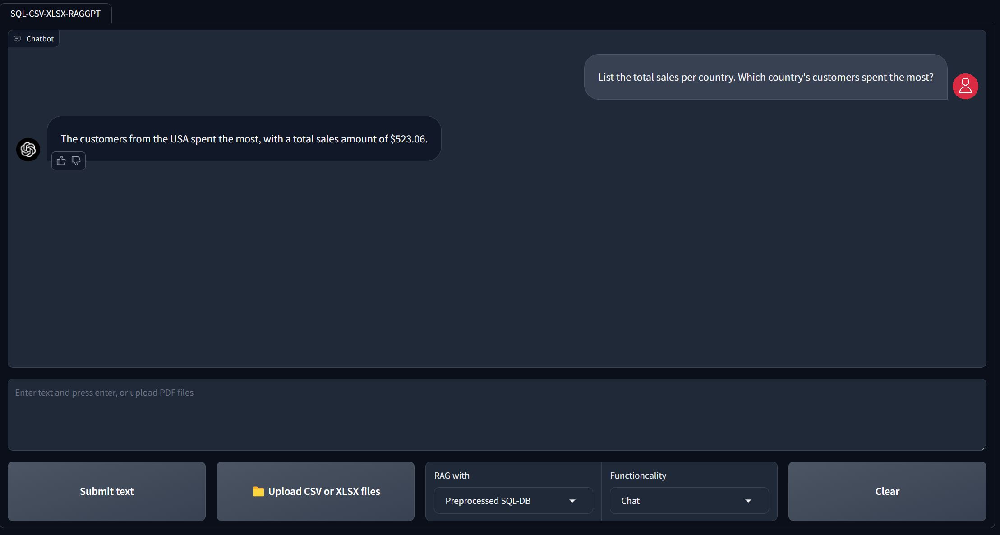

# KnowledgeGraph-Q&A-and-RAG-with-TabularData

**KnowledgeGraph-Q&A-and-RAG-with-TabularData** is a chatbot project that leverages **Knowledge Graphs, GPT-3.5, LangChain Graph Agent, and Neo4j** to facilitate **Q&A and Retrieval-Augmented Generation (RAG)** with tabular datasets (**CSV, XLSX, etc.**). This project also demonstrates an approach for **constructing knowledge graphs from unstructured data** using **LLMs**.

---

## Features
- **Chat with a Graph Database** – Query data stored in a **Neo4j GraphDB** created from tabular data.
- **RAG with GraphDB** – Retrieve and generate responses using a **graph-based retrieval model**.

---

## Important Notes
- **Neo4j Databases:** Do **not** use a **WRITE-enabled** database. Restrict access to **READ-ONLY** mode to prevent unwanted data manipulation.
- **Knowledge Graph Construction:** Knowledge graphs can be created using **domain expertise** or through **advanced language models** such as **LangChain’s LLM Graph Transformer**.
- **Query Language Familiarity:** Understanding **Pandas, SQL, and Cypher** can enhance interaction with the chatbot.
- **LLM Non-Determinism:** Using **LLMs for knowledge graph construction** may yield **slightly different results** in repeated executions.

---

## Core Techniques
- **Knowledge Graph Construction**
- **LLM Chains and Agents**
- **Cypher Query Execution**

---

## System Requirements
- **Operating System:** Linux or Windows (**Tested on WSL for Windows**).
- **OpenAI / Azure OpenAI Credentials:** Required for GPT functionality.

---

## Installation

### **1. System Setup**
```
sudo apt update && sudo apt upgrade
python3 -m venv tabular-kg-env
git clone <repository>
```

### **2. Navigate to the Project Directory**
```
cd TabularData-KnowledgeGraph-Q&A-With-GPT
```

### **3. Activate the Virtual Environment**
```
source ...Path to the environment/tabular-kg-env/bin/activate
pip install -r requirements.txt
```

---

## Execution

### **1. Setting Up Neo4j**
1. **Create and start a Neo4j GraphDB** (Remote server or **Neo4j Desktop** recommended).
2. **Upgrade to at least Neo4j Version 5.17.0**.
3. **Install Required Plugins:**
   - **APOC** (Advanced Procedures)
   - **Graph Data Science Library (GDS)**

4. **Modify `neo4j.conf` File:**
   - Comment out:  
     ```  
     # server.directories.import=import  
     ```  
   - Uncomment:  
     ```  
     dbms.security.auth_enabled=true  
     ```  
   - Ensure these settings are correctly configured:  
     ```  
     dbms.security.allow_csv_import_from_file_urls=true  
     dbms.security.procedures.unrestricted=jwt.security.*,apoc.*,genai.*  
     dbms.security.procedures.allowlist=apoc.*,gds.*,genai.*  
     ```  
   - Copy `neo4j-genai-plugin-5.17.0.jar` from the **products** folder into **Neo4j plugins**.

---

### **2. Loading Data & Constructing the Knowledge Graph**
1. **Prepare the knowledge graph** and load data into the GraphDB:
   - Follow **`explore/Movie_sample_csv_data`**
   - Use **`1_load_and_save_movie_data.ipynb`**
   - Execute **`2_AzureOpenAI_GraphDB_RAG_data_preparation.ipynb`**
2. **Test the GraphDB with direct Cypher queries**:
   - Use **`explore/3_query_movieDB_with_cypher.ipynb`**

---

### **3. Running the Chatbot**
Launch the chatbot:
```
python src/app.py
```

Once running, start interacting with the chatbot.

---

## Movie Knowledge Graph
<div align="center">
  
</div>

---

## Chatbot Project Schema
<div align="center">
  
</div>

---

## Chatbot User Interface
<div align="center">
  
</div>

---

## Neo4j Function References
- **Neo4j Fuzzy Search:**
  - [apoc.text.fuzzyMatch](https://neo4j.com/labs/apoc/4.3/overview/apoc.text/apoc.text.fuzzyMatch/)
  - [Soundex Search](https://neo4j.com/developer/kb/how-to-perform-a-soundex-search/)
- **Neo4j Vector Indexes:**  
  [Vector Index Documentation](https://neo4j.com/docs/cypher-manual/current/indexes/semantic-indexes/vector-indexes/)

---

## Preloaded Databases
- **Movie Dataset** – [Download](https://raw.githubusercontent.com/tomasonjo/blog-datasets/main/movies/movies_small.csv)
- **Medical Reports Dataset** – [Download](https://github.com/neo4j-part
